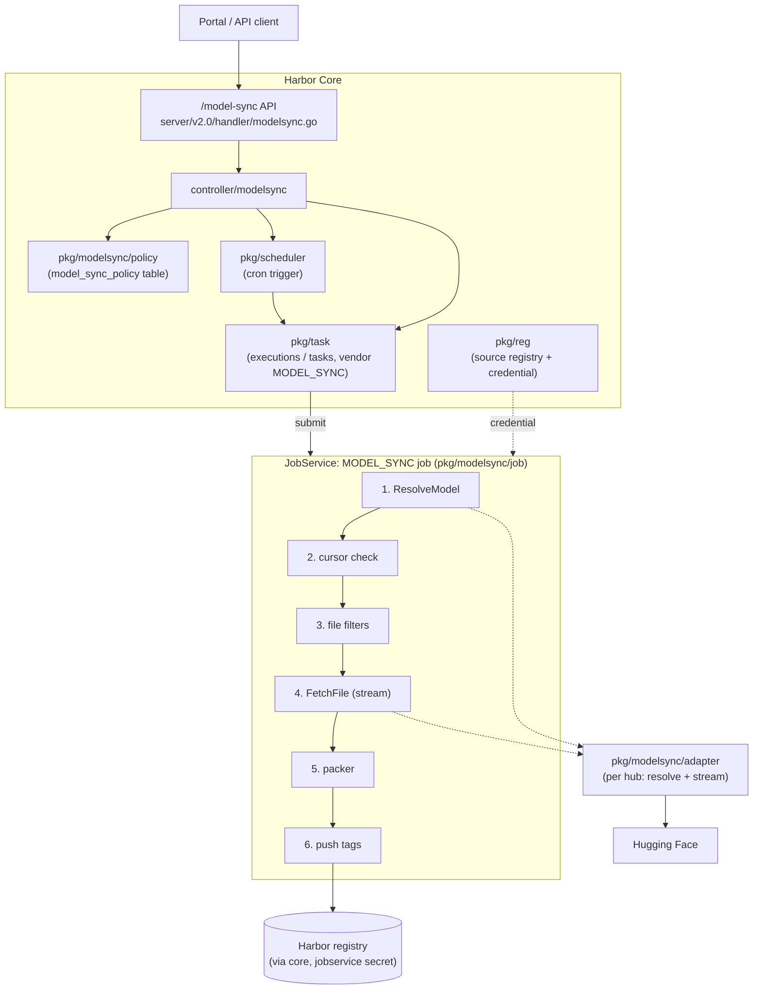

# Model Sync Adapter Framework

> Available starting with Harbor v2.17.0. User-facing documentation lives on
> [goharbor.io/docs](https://goharbor.io/docs); this page is the developer reference.

Model Sync pulls AI models from upstream model hubs (Hugging Face first) into Harbor as
OCI artifacts packaged according to the [ModelPack model spec](https://github.com/modelpack/model-spec).
It runs parallel to replication and reuses its building blocks: registry management for
the source endpoint and credential, policy / trigger management, and the execution / task
manager for observability. The design is described in the
[proposal](https://github.com/goharbor/community/pull/297).

## Table of Contents
- [Architecture](#architecture)
- [Packages](#packages)
- [Model Adapter contract](#model-adapter-contract)
- [Packaging and determinism](#packaging-and-determinism)
- [Sync pipeline](#sync-pipeline)
- [API](#api)
- [RBAC](#rbac)
- [Configuration](#configuration)
- [Adding a new hub adapter](#adding-a-new-hub-adapter)
- [Testing](#testing)

## Architecture



## Packages

| Package | Purpose |
| --- | --- |
| `pkg/reg/adapter/huggingface` | The `huggingface` **registry type**. Implements only `Info` / `HealthCheck`, advertises no replication resource types so it never appears as a replication candidate. Endpoint defaults to `https://huggingface.co` (mirrors supported), the token is stored as the access secret. |
| `pkg/modelsync/adapter` | The hub-agnostic **Model Adapter contract** and factory registry. |
| `pkg/modelsync/adapter/huggingface` | Hugging Face implementation: Hub API resolve (commit sha, tree with `Link` pagination, LFS sha256, model card metadata) and `/resolve` streaming with `Range`. |
| `pkg/modelsync/filter` | Doublestar file filters (`Validate`, `Match`, `Apply`). |
| `pkg/modelsync/packer` | Deterministic model-spec packer and file classification. |
| `pkg/modelsync/policy` | ORM model, DAO and manager for `model_sync_policy`. |
| `pkg/modelsync/job` | The `MODEL_SYNC` jobservice job. |
| `controller/modelsync` | Policy validation, scheduling, execution start / stop, preview, check-in processing. |
| `server/v2.0/handler/modelsync.go` | REST handlers generated from `api/v2.0/swagger.yaml` (tag `model_sync`). |
| `portal/src/app/base/left-side-nav/model-sync` | Administration → Model Sync pages. |

## Model Adapter contract

```go
type Adapter interface {
    Info(ctx context.Context) (*Info, error)
    HealthCheck(ctx context.Context) error
    ResolveModel(ctx context.Context, ref ModelRef) (*Revision, error)
    FetchFile(ctx context.Context, rev *Revision, path string, offset int64) (io.ReadCloser, error)
}
```

* `ResolveModel` turns a branch / tag / commit into an immutable `Revision` (`ID`, sorted `Files`
  with size and, when the hub provides it, sha256, model card `Metadata`, `SourceURL`).
* `FetchFile` streams one file **at the resolved revision** (never at the moving ref) and
  supports an `offset` for resumption.
* Everything OCI (layers, digests, manifest, push) is owned by the framework. Adapters never
  fake registry semantics.

Adapters are registered per registry type:

```go
func init() {
    adapter.RegisterFactory(model.RegistryTypeHuggingFace, adapter.FactoryFunc(func(r *model.Registry) (adapter.Adapter, error) {
        return New(r), nil
    }))
}
```

## Packaging and determinism

`pkg/modelsync/packer` builds the artifact under these rules, so the same upstream revision with
the same filters always produces a **bit-identical manifest digest**:

1. Files are ordered lexicographically by path (hub bookkeeping files like `.gitattributes` are dropped).
2. Each file becomes one raw layer (no tar, no compression) typed by its class:
   `weight` → `application/vnd.cncf.model.weight.v1.raw`,
   `config` → `...weight.config.v1.raw`, `code` → `...code.v1.raw`, `doc` → `...doc.v1.raw`.
   The classification patterns are adapted from [modctl](https://github.com/modelpack/modctl).
   Each layer carries `org.cncf.model.filepath`.
3. The model-spec config (`application/vnd.cncf.model.config.v1+json`) is serialized with sorted
   keys and no timestamps; `modelfs.diffIds` equal the layer digests (raw layers are uncompressed).
4. The manifest (`artifactType: application/vnd.cncf.model.manifest.v1+json`) has a stable field
   order and records provenance:
   `io.goharbor.model-sync.source-url`, `io.goharbor.model-sync.revision`,
   `io.goharbor.model-sync.adapter`, `io.goharbor.model-sync.repository`, plus
   `org.opencontainers.image.source` / `.revision` / `.licenses`.

Files with a hub-provided sha256 are skipped when the blob already exists in the destination
repository. Others are hashed while streaming through the chunked upload API, so nothing is
materialized on local disk. Tags: the immutable `sha-<12 chars of revision>` is always applied;
when the policy tracks a branch or tag, its sanitized name is applied as a moving tag.

## Sync pipeline

One policy run is one execution with **one task** (one model = one artifact):

1. Create the model adapter for the source registry (with credential).
2. `ResolveModel(repository, revision)`.
3. Apply the file filters.
4. Cursor check: when `last_synced_revision == revision` **and** `<dest>:sha-<12>` exists, the task
   reports `skipped: true` and succeeds without pushing. If the cursor matches but the artifact
   is missing (e.g. deleted), the model is re-synced.
5. Pack and push to the local registry through core with the jobservice secret, so quota,
   events and webhooks apply as for any push.
6. The job checks in `{revision, digest, tags, files, size, skipped}`; the controller records it
   on the task (`extra_attrs`) and advances the policy cursor.

Only one active execution per policy is allowed; a second start is marked as an error with an
explanatory message. Editing the source (registry, repository, revision, filters, destination)
resets the cursor.

## API

All endpoints are system-level (`/api/v2.0/model-sync/...`) and require the system
administrator role (or matching robot permissions):

| Method | Endpoint |
| --- | --- |
| GET / POST | `/model-sync/policies` |
| GET / PUT / DELETE | `/model-sync/policies/{id}` |
| GET / POST | `/model-sync/policies/{id}/executions` (list / trigger manually) |
| GET / PUT | `/model-sync/executions/{execution_id}` (get / stop) |
| GET | `/model-sync/executions/{execution_id}/tasks` |
| GET | `/model-sync/executions/{execution_id}/tasks/{task_id}/log` |
| POST | `/model-sync/preview` (resolve a source and list classified files without importing) |
| GET | `/model-sync/adapters` (registry types with a model adapter) |

## RBAC

Two system resources are added: `model-sync-policy` (`create`, `read`, `update`, `delete`, `list`)
and `model-sync` (`create` = trigger, `read`, `list`, `stop`). Both are available to system robot
accounts.

## Configuration

| Setting | Default | Description |
| --- | --- | --- |
| `REPLICATION_ADAPTER_WHITELIST` | includes `huggingface` | Registry types shown in registry management. |
| `MODEL_SYNC_EXECUTION_RETENTION_COUNT` | `50` | Executions retained per policy by the execution sweeper. |

Gated / private models: complete the agreement on the hub with your own account and configure
that account's access token on the registry endpoint. Harbor performs bearer token auth only.

## Adding a new hub adapter

1. Add a registry type in `pkg/reg/model` and a base registry adapter under `pkg/reg/adapter/<hub>`
   (`Info` with **empty** `SupportedResourceTypes`, `HealthCheck`), import it in `pkg/reg/manager.go`
   and `jobservice/job/impl/replication/replication.go`, and add the type to
   `REPLICATION_ADAPTER_WHITELIST` in `make/photon/prepare/templates/core/env.jinja`.
2. Implement `pkg/modelsync/adapter.Adapter` under `pkg/modelsync/adapter/<hub>` and register it in
   `init()`. Import the package (blank import) in `pkg/modelsync/job` and `controller/modelsync`.
3. Populate `Revision.Metadata` with the well-known keys (`license`, `pipeline_tag`, `library`,
   `author`, `tags`, `description`) so the packer can fill the model-spec descriptor.
4. Add the display name to `ADAPTERS_MAP` in `portal/src/app/shared/services/endpoint.service.ts`.
5. Unit test against an `httptest` server; the controller, job and packer need no changes.

## Testing

```bash
# unit tests (the DAO test needs Postgres, see tests/ci/ut_run.sh for the env vars)
cd src && go test ./pkg/modelsync/... ./controller/modelsync/ ./pkg/reg/adapter/huggingface/ ./server/v2.0/handler/

# portal
cd src/portal && npx ng test --watch=false --browsers=ChromeHeadlessNoSandbox \
  --include='src/app/base/left-side-nav/model-sync/**/*.spec.ts'

# end to end against a running Harbor (uses hf-internal-testing/tiny-random-gpt2)
HARBOR_HOST=... python tests/apitests/python/test_model_sync.py
```
