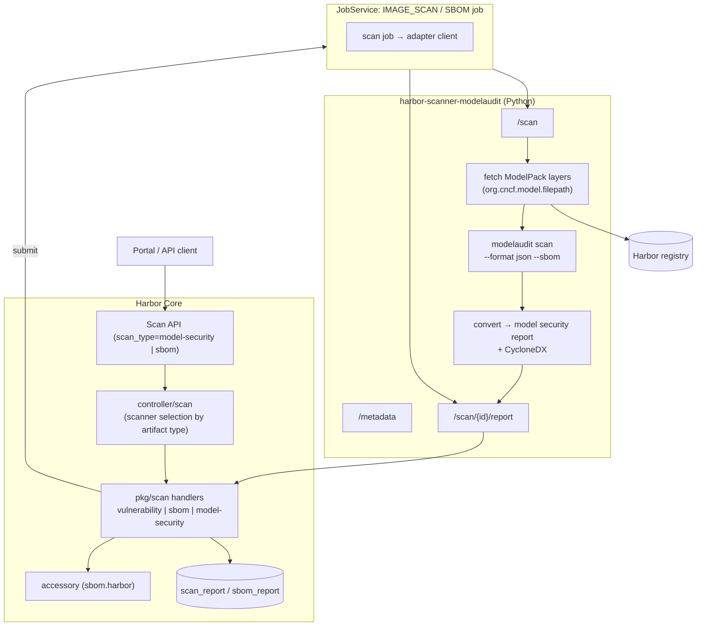

# Proposal: Model Security Scanning and SBOM

Author: [Chenyu Zhang](https://github.com/chlins)

Discussion: TBD

## Abstract

This proposal adds security scanning and SBOM generation for AI model artifacts
(ModelPack / CNAI) to Harbor. It extends the pluggable scanner framework with a new
scan type, `model-security`, and a dedicated report format tailored to model
findings (unsafe pickle opcodes, embedded code, template injection, secrets, weight
anomalies, ...), and ships `harbor-scanner-modelaudit`, a scanner adapter built on
[ModelAudit](https://www.promptfoo.dev/docs/model-audit/) as the reference
implementation. SBOMs for models are produced as CycloneDX 1.6 and stored as
accessories exactly like image SBOMs today.

## Motivation

With the AI Model Processor and Model Sync, Harbor understands and imports OCI model
artifacts. What is missing is the same security posture Harbor gives container images:
scan on push, a report with severities, an SBOM and a policy gate.

Models carry a different threat model than images. A `pickle` or `.pt` file executes
arbitrary code when loaded; Keras Lambda layers, TorchScript, ONNX custom ops and
Jinja chat templates (CVE-2024-34359) are code execution vectors; model repositories
routinely contain leaked credentials. None of this is a CVE against a package, so the
vulnerability report Harbor renders today (package / version / fix version / CVSS)
cannot express it. Container scanners like Trivy do not look at model files either.

ModelAudit is a mature (59 format scanners), MIT licensed, actively maintained static
scanner with JSON, SARIF and CycloneDX outputs, which makes it a good reference
adapter. The framework, however, is scanner agnostic: any tool that speaks the adapter
API and produces the model security report can be plugged in (e.g. protectai/modelscan).

## Goals

1. Define a **model security report** format (a new report MIME type) that carries
   model findings with severity, file location, scanner rule and explanation.
2. Add the `model-security` **scan type** to Harbor's scanner framework alongside
   `vulnerability` and `sbom`, reusing registration, scheduling, jobs, report storage,
   scan-all, scan-on-push and RBAC.
3. Let a scanner declare capabilities for the **model manifest MIME type**
   (`application/vnd.cncf.model.manifest.v1+json`) and make Harbor pick a scanner that
   matches the artifact type, so images keep going to Trivy while models go to a model
   scanner.
4. Generate **CycloneDX SBOMs for models** and store them as `sbom.harbor` accessories,
   downloadable from the artifact page.
5. Ship **`harbor-scanner-modelaudit`** (Python, own repository) as the reference
   adapter. It is deployed out of tree and registered like any other scanner.
6. Render findings and the SBOM in the Portal on the model artifact page, with the
   scan summary in the artifact list.

## Non-Goals

1. Writing model scanners inside Harbor. Harbor orchestrates, adapters scan.
2. Runtime / behavioural model testing (red teaming, evals).
3. Blocking pulls based on findings (a policy gate is a natural follow-up once the
   report exists; it is out of scope here).
4. SPDX output for model SBOMs. CycloneDX is what ModelAudit produces natively; SPDX
   can be added later by conversion if needed.

## Architecture



Everything above the adapter is existing machinery. The new pieces are the scan type,
the report format, the artifact-type aware scanner selection and the Portal panels.

## Design

### 1. Scanner capability for models

The adapter metadata already lets a scanner declare capabilities per consumed MIME
type. Today Harbor requires every capability to consume the Docker manifest MIME type
and only lets `IMAGE` artifacts be scanned. Both restrictions are lifted:

```json
{
  "scanner": { "name": "ModelAudit", "vendor": "Promptfoo", "version": "0.2.52" },
  "capabilities": [
    {
      "type": "model-security",
      "consumes_mime_types": ["application/vnd.cncf.model.manifest.v1+json"],
      "produces_mime_types": ["application/vnd.security.model.report+json; version=1.0"]
    },
    {
      "type": "sbom",
      "consumes_mime_types": ["application/vnd.cncf.model.manifest.v1+json"],
      "produces_mime_types": ["application/vnd.security.sbom.report+json; version=1.0"]
    }
  ],
  "properties": { "harbor.scanner-adapter/scanner-type": "model" }
}
```

Validation rule change: a capability must consume at least one of the Docker manifest,
OCI manifest or CNCF model manifest MIME types, and must produce a supported report
MIME type for its `type`.

`hasCapability(registration, artifact)` becomes artifact-type aware: `IMAGE` artifacts
match capabilities consuming image manifests, `CNAI` artifacts match capabilities
consuming the model manifest. Other artifact types stay unscannable.

### 2. Scanner selection: one scanner per project is not enough

A project routinely holds both images and models. Harbor resolves **one** scanner per
project (project metadata, else the system default). With this proposal the resolution
becomes: *the project scanner if it has a capability for the artifact, else the first
enabled scanner that does*. Concretely:

1. Resolve the project scanner as today.
2. If it lacks a capability for the artifact's manifest MIME type, fall back to the
   first enabled registration (ordered by creation time) that has one. This implicit
   resolution needs no new setting; an explicit "default scanner per artifact type" can
   be added later if instances register several model scanners.
3. If none, the artifact is unscannable (same error as today).

This keeps the existing UX (Trivy stays the project/default scanner for images) and
lets an admin register ModelAudit once for the whole instance. The scanner list page
shows which artifact types each registration supports.

### 3. Model security report

New report MIME type `application/vnd.security.model.report+json; version=1.0`.

```json
{
  "generated_at": "2026-09-18T05:12:53Z",
  "scanner": { "name": "ModelAudit", "vendor": "Promptfoo", "version": "0.2.52" },
  "severity": "Critical",
  "summary": { "total": 3, "critical": 1, "high": 0, "medium": 1, "low": 1, "files_scanned": 6, "bytes_scanned": 485909, "scanners": ["gguf", "text", "manifest"] },
  "findings": [
    {
      "id": "MA-PICKLE-ISSUE",
      "severity": "Critical",
      "message": "Suspicious module reference found: posix.system",
      "why": "The 'os' module provides direct access to operating system functions.",
      "file": "pytorch_model.bin",
      "location": "pos 28",
      "scanner": "pickle",
      "details": { "module": "posix", "function": "system" },
      "links": ["https://www.promptfoo.dev/docs/model-audit/scanners/#pickle-scanner"]
    }
  ]
}
```

Severity mapping from ModelAudit: `critical → Critical`, `warning → Medium`,
`info → Low`, `debug` dropped. `severity` at the top is the maximum finding severity
(`None` when there are no findings), which is what the artifact list summary and the
future policy gate use. The scanner adapter may also return the raw ModelAudit JSON
under `application/vnd.scanner.adapter.model.report.raw` for the "raw report" download.

Storage: the existing `scan_report` table (`mime_type` column distinguishes it). A new
`pkg/scan/modelsecurity` handler implements the scan `Handler` interface (placeholder,
update, summary) in the same shape as `pkg/scan/vuln`. Summary for the artifact list:
`{"severity": "Critical", "total": 3, "critical": 1, ...}` under
`scan_overview[<model report mime>]`.

### 4. SBOM for models

The `sbom` scan type already exists; two changes make it work for models:

- the SBOM handler's media type becomes a parameter of the request/report instead of
  the hard-coded `application/spdx+json`; the adapter reports
  `application/vnd.cyclonedx+json`, and the accessory annotation records it;
- the SBOM Portal panel and download use the recorded media type for the file name.

The CycloneDX document produced by ModelAudit lists one `machine-learning-model` /
`data` component per file with SHA-256, size, license expression and `risk_score`
properties. Harbor stores it verbatim as an `sbom.harbor` accessory of the model.

### 5. Scan on push / auto SBOM

`autoScan` and `autoGenSBOM` are type-agnostic; once `hasCapability` accepts `CNAI`,
models pushed by clients (modctl, ORAS) or imported by Model Sync are scanned when the
project has "Automatically scan images on push" / "Automatically generate SBOM" on.
The two project settings are renamed in the UI to "artifacts" where they say "images".
Scan All and the scheduled scan include models the same way.

### 6. The reference adapter: `harbor-scanner-modelaudit`

A new repository (`harbor-scanner-modelaudit`, incubated under the author's account and
moved to the goharbor organisation once stable), written in Python (FastAPI) so that
ModelAudit runs in-process:

```
GET  /api/v1/metadata
POST /api/v1/scan                      → {"id": "<uuid>"}
GET  /api/v1/scan/{id}/report          Accept: model report | sbom report | raw
```

Flow for a scan request:

1. Pull the manifest with the registry credentials from the request; reject anything
   whose `artifactType` is not the model manifest.
2. Stream each layer into a temp directory named by `org.cncf.model.filepath`
   (path-traversal safe, per-file and total size limits, timeout). Layers are raw files,
   so no untar.
3. Run `modelaudit.core.scan_model_directory_or_file(dir, ...)` and
   `generate_sbom(...)`.
4. Convert to the Harbor model security report (mapping above) and keep the raw JSON.
5. Store the result keyed by scan id (Redis, like the Trivy adapter, so the adapter can
   run with multiple replicas), TTL configurable.

Configuration by environment: `SCANNER_API_SERVER_ADDR`, `SCANNER_REDIS_URL`,
`SCANNER_JOB_TTL`, `SCANNER_MODELAUDIT_TIMEOUT`, `SCANNER_MODELAUDIT_MAX_SIZE`,
`SCANNER_MODELAUDIT_MIN_SEVERITY` (default `warning`, so `info` findings such as URLs in
README are excluded from the report but kept in the raw output). ModelAudit's
`--blacklist` / `--strict` / scanner selection are not exposed in v1.

Image: `goharbor/harbor-scanner-modelaudit`, Python 3.12 slim, `modelaudit[all]` minus
TensorFlow/Torch extras by default (they are only needed for deep inspection of a few
formats and add gigabytes), with a `-full` variant.

Deployment: the adapter is run out of tree (its own container / Helm values) and
registered once through Administration → Interrogation Services → Scanners, or the
`/scanners` API. Bundling it in the Harbor installer (`--with-modelaudit`) is deferred
until the adapter has matured; nothing in Harbor depends on the adapter being in tree.

### 7. Portal

- Artifact page (CNAI): a **Security** addition tab (the name is deliberately not
  "Vulnerabilities": findings are not CVEs and have no CVSS or fix version) listing findings (severity badge,
  file, message, "why" expandable, scanner, rule link), with Scan / Stop buttons and the
  scan status, plus the existing SBOM tab (Generate / Download / view).
- Artifact list: the scan overview column shows the model report summary (severity +
  counts) the same way it does for images.
- Scanner registration list and project scanner selection show the supported artifact
  types (`Image`, `Model`) per scanner.
- Model Sync execution detail links to the resulting scan when auto scan is enabled.

## API

No new endpoints. Existing ones are extended:

| Endpoint | Change |
| --- | --- |
| `POST /projects/{p}/repositories/{r}/artifacts/{ref}/scan` | `scan_type` accepts `model-security` (and `sbom` for models) |
| `POST .../scan/stop` | same |
| `GET .../artifacts/{ref}` `X-Accept-Vulnerabilities` | accepts the model report MIME type; `scan_overview` carries its summary |
| `GET .../artifacts/{ref}/additions/vulnerabilities` | returns the model report when the artifact is a model and the header asks for it (or a new `additions/security` alias) |
| `GET /scanners`, `/scanners/{id}/metadata` | `capabilities` include `model-security` and the artifact types |
| `GET /projects/{p}/scanner/candidates` | unchanged, plus supported types in the payload |

Swagger: `ScanType.scan_type` enum gains `model-security`; new definitions
`ModelSecurityReport`, `ModelSecurityFinding`, `ModelSecuritySummary`.

## Data model

No new tables. `scan_report.mime_type` gets the new value; `sbom_report.media_type`
already exists and will hold `application/vnd.cyclonedx+json`. The accessory annotation
for SBOM gains `sbom.media_type`.

## Security considerations

- The adapter only receives a short-lived robot credential scoped to pull the
  artifact, as with Trivy.
- Downloaded model files are written to a scratch volume with size limits and removed
  after the scan; the adapter never loads the model with a framework, only static
  analysis (ModelAudit does not unpickle).
- ModelAudit's own network features (hf://, s3://) are not used; the adapter always
  scans the local copy pulled from Harbor.
- Raw reports may contain strings extracted from model files (URLs, possible secrets).
  They are stored like raw Trivy reports and only visible to users with scan read
  permission.

## Rationale

*Why a new report type and not the vulnerability report?* The vulnerability report is
package-centric (package/version/fix/CVSS). Forcing model findings into it produces a
misleading UI (empty CVSS, "fix version" columns) and blocks a proper policy gate
later. A dedicated, small report format costs one handler and one Portal panel.

*Why extend the scanner framework and not a Model Sync side job?* Scanning must cover
models pushed by any client, not only synced ones, and must be replaceable by other
scanners. The scanner framework already gives registration, jobs, retries, scan-all,
scan-on-push, report storage and RBAC.

*Why Python for the adapter?* ModelAudit is a Python library; calling it in-process
avoids a second runtime, subprocess plumbing and JSON re-parsing. The adapter is an
independent container, so the language choice does not affect Harbor.

*Why per-artifact-type scanner selection?* Without it, enabling model scanning in a
project would disable image scanning (or vice versa). Selecting by capability keeps the
current single-scanner UX for the common case while supporting mixed projects.

## Compatibility

Purely additive. Existing scanners keep validating (Docker manifest capability is still
accepted), existing reports and SBOMs are untouched, and projects without a model
scanner registered behave exactly as before (models are reported as unscannable, as
today).

## Implementation plan

**Harbor (target v2.17)**

1. `pkg/scan/rest/v1`: model manifest MIME, `ScanTypeModelSecurity`, model report MIME,
   relaxed capability validation, CycloneDX media type.
2. `controller/scan/checker.go` + `controller/scanner`: artifact-type aware
   `hasCapability` and scanner resolution (project scanner → capable enabled scanner).
3. `pkg/scan/modelsecurity`: report model, handler (placeholder / update / summary),
   registration with `RegisterScanHanlder`.
4. `pkg/scan/sbom`: media type parameterised; accessory annotation.
5. Swagger + handlers: `scan_type` enum, report definitions, `X-Accept-Vulnerabilities`
   handling, scanner capabilities payload.
6. Event handlers: verify scan-on-push / auto SBOM for CNAI; project settings wording.
7. Portal: Security tab, SBOM tab for models, artifact list summary, scanner list
   artifact types.
8. Installer integration: deferred, the adapter stays out of tree for now.
9. Tests: unit (handlers, checker, converters), API test with a fake adapter, robot
   case with the real adapter.
10. Docs.

**harbor-scanner-modelaudit (new repository)**

1. FastAPI skeleton, adapter API v1, Redis job store, health endpoint.
2. Registry client: manifest fetch, layer streaming to scratch dir with limits.
3. ModelAudit runner and report/SBOM converters.
4. Dockerfile (slim + full), Makefile, CI (lint, tests, image build), README.

## Open issues

1. Whether `info` findings should be shown in the UI behind a toggle rather than
   filtered by the adapter.
3. Size limits and timeouts for very large models (tens of GB): the adapter must
   download the whole model to scan it; a `max_size` beyond which the scan is reported
   as `Skipped` needs a sensible default.
4. Whether to also emit SARIF for CI consumption (ModelAudit supports it; Harbor has no
   place to store it today).
5. Policy gate ("prevent pull of models with Critical findings") as a follow-up.

## References

- ModelAudit: https://www.promptfoo.dev/docs/model-audit/ ,
  https://github.com/promptfoo/modelaudit
- Pluggable scanner spec: https://github.com/goharbor/pluggable-scanner-spec
- Trivy adapter: https://github.com/goharbor/harbor-scanner-trivy
- CycloneDX 1.6 ML-BOM: https://cyclonedx.org/capabilities/mlbom/
- Model Sync proposal: https://github.com/goharbor/community/pull/297
